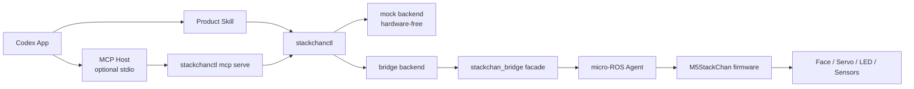
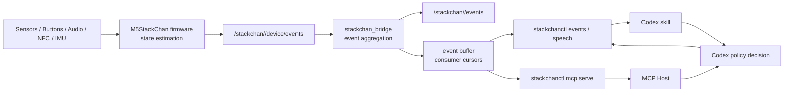
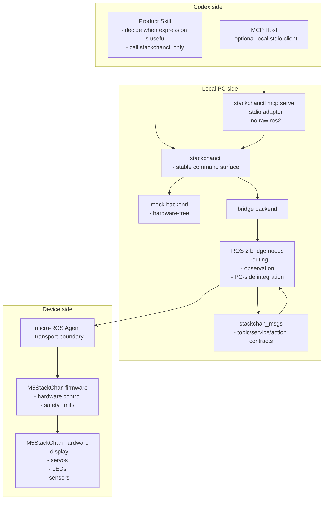

# Architecture Notes

## Core idea

Codex should not talk to StackChan through a cloud account, mobile app, or ad hoc network API. It should call a local command, and the local command should speak ROS 2.



StackChan can also report local device events back toward Codex. This reverse
path is observational, not a device-side command path:



The split is:

- State estimation belongs to firmware and bridge.
- Policy and behavior choice belong to Codex.
- Safety and hard limits belong to firmware.
- Routing, redaction, buffering, and PC-side speech sessions belong to bridge.

## Responsibility split

- Codex-facing product skill decides when a restrained physical expression is useful.
- `stackchanctl` provides a small, stable command surface.
- `stackchanctl mcp serve` provides an optional stdio MCP adapter over the same command surface.
- ROS 2 nodes own routing, observation, and PC-side integration.
- micro-ROS firmware owns hardware control and safety limits.
- Shared message definitions keep the boundary explicit.

Layer details:

- CLI design: [stackchanctl.md](stackchanctl.md)
- ROS 2 interface: [ros-interface.md](ros-interface.md)
- Firmware design: [firmware.md](firmware.md)

Development decisions:

- The standard command path is `stackchanctl -> stackchan_bridge facade -> firmware`.
- MCP integrations use `stackchanctl mcp serve -> stackchanctl command contract -> mock or bridge backend`.
- Direct CLI-to-device ROS calls are for diagnostics and bring-up only.
- `stackchanctl` is a Python `rclpy` CLI.
- Single-device and multi-device operation use the same contract through `device_id`.
- The default ROS namespace shape is `/stackchan/<device_id>`, with `default` as the default device id.
- Rust is a companion-worker language for measured hot paths or long-running workers, such as audio buffering, camera pre-processing, or high-rate IMU filtering.
- Rust workers must preserve the same command metadata and error contracts as the Python CLI.
- ROS interfaces are feature-specific rather than one generic command bus.
- Command-bearing interfaces include `device_id`, `command_id`, `source`, `created_at`, and `priority`.
- Command priority is `LOW`, `NORMAL`, `HIGH`, or `SAFETY`; `SAFETY` is reserved for bridge/firmware internal use.
- Errors use `code`, `message`, and `recoverable`.
- Firmware owns safety defaults; PC-side config owns normal tuning.
- Hard safety limits live in firmware constants, individual calibration lives in firmware NVS, normal tuning lives in ROS package YAML, and CLI config only owns convenience settings.
- Device identity is mapped by bridge configuration; firmware may report hardware identity for diagnostics, but `device_id` binding belongs on the PC side.
- Mock backend support is required for CLI and Codex skill development.
- Logs and CLI output should support structured JSON.
- MCP stdio output must keep `stdout` reserved for JSON-RPC and send logs to `stderr`.
- Status, events, logs, and command results must include `device_id`.
- Firmware publishes hardware-origin events under `/stackchan/<device_id>/device/events`.
- `stackchan_bridge` owns the public `/stackchan/<device_id>/events` topic and
  the event buffer queried by `stackchanctl` and MCP tools.
- Codex treats events as observations. It does not execute an event name as a
  command; it decides whether to call `say`, `face`, `motion`, `led`, audio, or
  no command at all.
- Speech transcripts are not placed directly in normal event payloads. Bridge
  publishes `transcript_ready` with an `utterance_id`, and Codex explicitly
  retrieves the transcript when it needs it.
- Canonical development environment is Ubuntu 24.04 with ROS 2 Jazzy. Host
  machines should use the documented Docker/devcontainer workflow instead of
  installing ROS 2 directly; Windows developers should use a WSL2-backed Docker
  environment.
- Logs must include `device_id`, `command_id` when available, `source` when available, and structured error fields.
- Logs must redact secrets, speech text, PCM audio, image payloads, NFC tag IDs,
  IR/raw remote codes, and protocol dumps by default. Debug opt-in may expose
  sensitive values only in explicit local developer diagnostics, never in
  normal CLI output or public events.
- The repository license is MIT.
- Work can continue on `main` until release discipline is needed.

## Device identity

The project should support one or more StackChan devices through the same contract.

Rules:

- Every physical or mock StackChan has a `device_id`.
- `default` is the standard single-device id.
- `device_id` should use only ASCII letters, numbers, `_`, and `-`.
- ROS resources live under `/stackchan/<device_id>`.
- Firmware-owned device-side resources live under
  `/stackchan/<device_id>/device/...`; bridge facade commands live under
  `/stackchan/<device_id>/cmd/...`; bridge-owned public status, telemetry, and
  events live directly under `/stackchan/<device_id>/...`.
- Avoid bare `/device/...` shorthand in implementation plans and issues. It can
  hide the `device_id` namespace that keeps multiple StackChan devices separate.
- CLI commands select the target with `--device <device_id>`.
- If `--device` is omitted, CLI config may provide a default; otherwise use `default`.
- `device_id` is separate from `command_id`.
- Status, events, logs, and command results include `device_id`.
- Multiple physical StackChan devices are separated by `device_id` namespaces.
  Multiple sensor elements within one StackChan are identified inside message
  fields, such as `sensor_index`, and do not create separate device namespaces.

Example namespaces:

```text
/stackchan/default/status
/stackchan/default/cmd/face/set
/stackchan/default/device/events
/stackchan/desk/status
/stackchan/desk/device/proximity/raw
/stackchan/livingroom/cmd/audio/play
```

## Layer ownership



## Hardware-free bootstrap

The repository should support useful development without hardware:

1. `stackchanctl` accepts `say`, `face`, `motion`, and `led`.
2. A mock backend logs normalized commands.
3. A bridge backend sends the same normalized commands through `stackchan_bridge`.
4. The Codex skill uses only the CLI surface.
5. MCP stdio mode can expose the same mock-compatible command surface to MCP hosts.
6. Rust is added only for measured worker boundaries.
