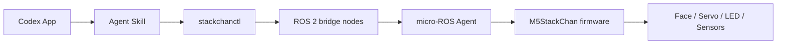
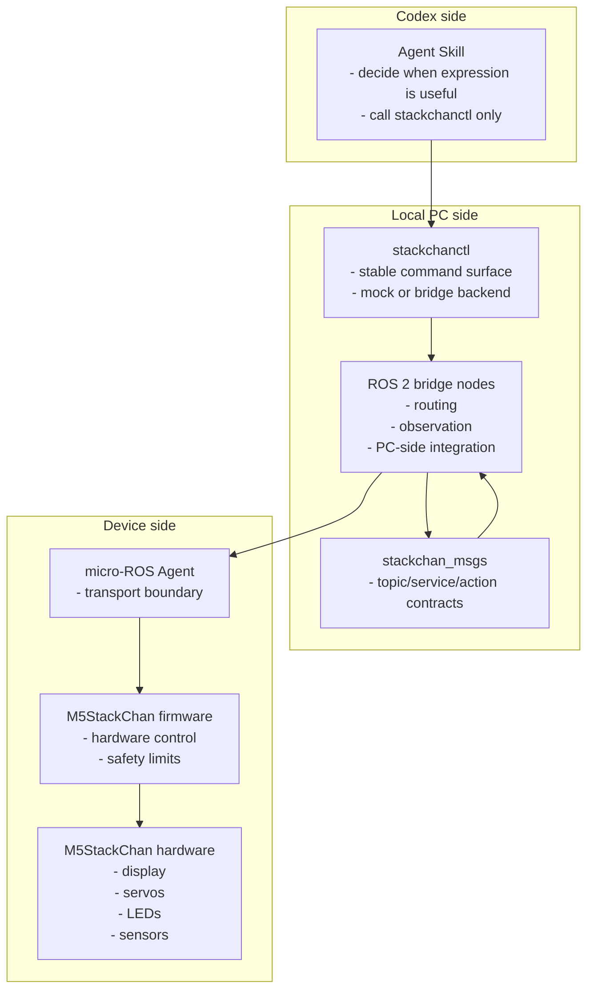

# Architecture Notes

## Core idea

Codex should not talk to StackChan through a cloud account, mobile app, or ad hoc network API. It should call a local command, and the local command should speak ROS 2.



## Responsibility split

- Codex agent skill decides when a physical expression is useful.
- `stackchanctl` provides a small, stable command surface.
- ROS 2 nodes own routing, observation, and PC-side integration.
- micro-ROS firmware owns hardware control and safety limits.
- Shared message definitions keep the boundary explicit.

Layer details:

- CLI design: [stackchanctl.md](stackchanctl.md)
- ROS 2 interface: [ros-interface.md](ros-interface.md)
- Firmware design: [firmware.md](firmware.md)

Development decisions:

- The standard command path is `stackchanctl -> stackchan_bridge facade -> firmware`.
- Direct CLI-to-device ROS calls are for diagnostics and bring-up only.
- `stackchanctl` is a Python `rclpy` CLI.
- Single-device and multi-device operation use the same contract through `device_id`.
- The default ROS namespace shape is `/stackchan/<device_id>`, with `default` as the default device id.
- Rust is a companion-worker language for measured hot paths or long-running workers, such as audio buffering, camera pre-processing, or high-rate IMU filtering.
- Rust workers must preserve the same command metadata and error contracts as the Python CLI.
- ROS interfaces are feature-specific rather than one generic command bus.
- Command-bearing interfaces include `device_id`, `command_id`, `source`, `created_at`, and `priority`.
- Command priority is `LOW`, `NORMAL`, `HIGH`, or `SAFETY`; `SAFETY` is reserved for bridge/firmware internal use.
- Errors use `code`, `message`, and `recoverable`.
- Firmware owns safety defaults; PC-side config owns normal tuning.
- Hard safety limits live in firmware constants, individual calibration lives in firmware NVS, normal tuning lives in ROS package YAML, and CLI config only owns convenience settings.
- Device identity is mapped by bridge configuration; firmware may report hardware identity for diagnostics, but `device_id` binding belongs on the PC side.
- Mock backend support is required for CLI and Codex skill development.
- Logs and CLI output should support structured JSON.
- Status, events, logs, and command results must include `device_id`.
- Canonical development environment is Ubuntu 24.04 with ROS 2 Jazzy; Windows development should use WSL2.
- Logs must include `device_id`, `command_id` when available, `source` when available, and structured error fields.
- Logs must redact secrets, speech text, image payloads, and NFC tag IDs by default. Debug opt-in may expose them only in local developer logs, never in normal CLI output.
- The repository license is MIT.
- Work can continue on `main` until release discipline is needed.

## Device identity

The project should support one or more StackChan devices through the same contract.

Rules:

- Every physical or mock StackChan has a `device_id`.
- `default` is the standard single-device id.
- `device_id` should use only ASCII letters, numbers, `_`, and `-`.
- ROS resources live under `/stackchan/<device_id>`.
- CLI commands select the target with `--device <device_id>`.
- If `--device` is omitted, CLI config may provide a default; otherwise use `default`.
- `device_id` is separate from `command_id`.
- Status, events, logs, and command results include `device_id`.

Example namespaces:

```text
/stackchan/default/status
/stackchan/default/cmd/face/set
/stackchan/desk/status
/stackchan/livingroom/cmd/audio/play
```

## Layer ownership



## Hardware-free bootstrap

The repository should support useful development without hardware:

1. `stackchanctl` accepts `say`, `face`, `motion`, and `led`.
2. A mock backend logs normalized commands.
3. A bridge backend sends the same normalized commands through `stackchan_bridge`.
4. The Codex skill uses only the CLI surface.
5. Rust is added only for measured worker boundaries.
