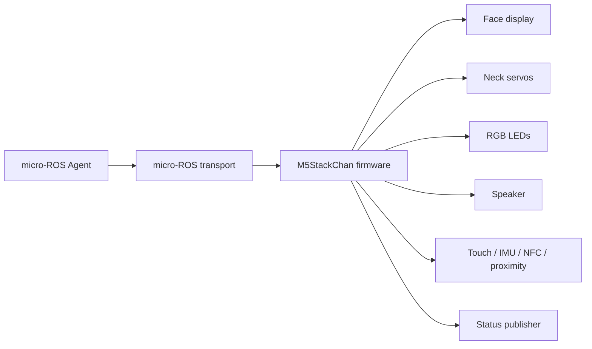
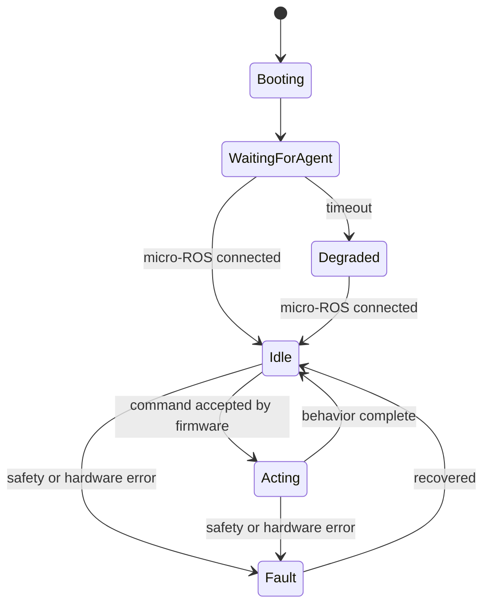

# Firmware Design

The firmware owns the device-side behavior of M5StackChan. It receives constrained commands through micro-ROS and turns them into local hardware actions.



## Goals

- Accept high-level commands from ROS 2.
- Drive face display, neck servos, LEDs, speaker, microphone, camera, NFC, IMU, and local sensors.
- Enforce physical safety limits on the device.
- Publish enough state for the PC-side bridge to know whether the robot is connected and healthy.
- Keep behavior deterministic when the PC sends simple commands such as `face happy` or `motion nod`.
- Keep each hardware feature independently developable behind a small adapter.

## Non-goals

- Do not run the main Codex logic on the device.
- Do not require cloud accounts or external authentication.
- Do not make the PC-side bridge responsible for the only copy of hardware safety limits.
- Do not expose raw hardware controls as the default public interface.
- Do not make the firmware depend on a specific Codex skill implementation.
- Do not fork the M5Stack factory firmware as the project baseline.

## Design stance

The firmware should be boring and protective. It should accept named robot intents, translate them into local behavior, and refuse anything unsafe or unsupported.

The PC side can be expressive; the device side should be constrained.

```text
Good:  motion = "nod", intensity = 0.5
Avoid: servo_x = 92, servo_y = 143, speed = 999
```

Raw controls may be useful for calibration later, but they should live behind explicit debug or maintenance interfaces, not the default command path.

## Hardware library policy

This project should not become a low-level hardware driver project. Hardware access should go through the official or community-maintained StackChan libraries whenever possible.

Preferred dependency direction:

- Use `StackChan-BSP` / `M5StackChan` style libraries for official M5StackChan hardware access.
- Use `M5Unified` and `M5GFX` through the supported StackChan library path rather than directly wiring every device feature from scratch.
- Treat servo drivers such as `FTServo_Arduino` as implementation details owned by the BSP layer unless a missing feature forces a small adapter.
- Keep `stackchan-arduino` in view as a community reference, especially for servo abstraction ideas, but do not mix multiple hardware abstraction stacks without a concrete reason.

This firmware owns the behavior layer:

- micro-ROS command ingress
- named command validation
- safety policy
- behavior-to-library adapter calls
- status publishing
- fault reporting and recovery

The lower layers own device mechanics:

- servo bus protocol
- display drawing primitives
- LED strip writes
- NFC, IMU, touch, proximity, audio, camera, and power-management drivers

If a hardware feature requires direct access, add it behind a small adapter and document why the BSP/library path was not enough.

Current references to re-check before implementation:

- M5Stack StackChan docs: official Arduino setup points users to the `M5StackChan` driver library and StackChan BSP resources.
- `m5stack/StackChan-BSP`: official board support package for Arduino development.
- `stack-chan/stackchan-arduino`: community Arduino library with servo abstraction for PWM, SCS, and Dynamixel XL330.
- M5Stack Home Assistant StackChan docs: useful for hardware ranges and component wiring, especially servo constraints.

Dependency and license policy is tracked in [license-notes.md](license-notes.md). In short: use `StackChan-BSP` as a dependency, treat `m5stack/StackChan` firmware as reference material, and avoid copying full upstream firmware trees into this repository.

## Baseline firmware decisions

- Build an independent custom firmware rather than forking the M5Stack factory firmware.
- Use `StackChan-BSP` as the preferred hardware access dependency.
- Keep factory firmware and community firmware as references, not as the implementation base.
- Structure hardware capabilities as separable adapters so face, motion, LED, audio, camera, NFC, IMU, and other sensors can be developed independently.
- Treat audio as a first-class capability, not a later decorative add-on.
- Keep cloud/account/app binding out of scope.
- Use USB Serial as the first micro-ROS transport.
- Use named intents as the default control model.
- Use `LOW`, `NORMAL`, `HIGH`, and `SAFETY` as the command priority model.
- Reserve `SAFETY` for bridge and firmware internal use.

The firmware should still start with a bring-up path, but the architecture should not assume that audio, camera, NFC, or raw IMU telemetry are out of scope. They are part of the target capability set.

## Configuration and calibration ownership

Configuration is split by risk:

- Firmware constants own hard safety limits.
- Firmware NVS owns individual device calibration, such as servo neutral offsets and safe per-device corrections.
- ROS package YAML owns normal operation tuning.
- CLI config owns convenience settings such as backend, default device, output mode, log level, and timeout defaults.

The firmware must not rely on CLI-side validation as the only protection for hardware safety.

Calibration NVS rules:

- Store a calibration schema version.
- Store a checksum/CRC or equivalent corruption marker.
- Read the NVS record during firmware setup and validate it before marking the
  calibration store valid. Missing records, corrupt records, unsupported schema
  versions, unsafe values, and checksum mismatches leave the store invalid.
- Use atomic write or rollback behavior so power loss cannot leave accepted
  partial calibration.
- Store servo neutral offsets and safe per-device corrections.
- Provide a reset/erase-to-invalid calibration path. Reset removes or
  invalidates the calibration record; it must not install a valid default
  calibration.
- Export/import may be added through explicit maintenance tooling, not normal command paths.
- Missing, corrupted, or schema-mismatched calibration is `CALIBRATION_INVALID`.
  All servo-actuating motion, pose, home, and status operations must reject it
  and must not fall back to CLI config for safety values. A neutral-only
  fallback is allowed only if firmware owns and tests that fallback as
  non-actuating or hard-limit-safe behavior.

Current MVP scaffold:

- `stackchan/calibration.hpp` defines the firmware-owned calibration record,
  schema version, NVS namespace/key, checksum validation, and default-invalid
  store behavior.
- The calibration record stores home basis and bounded per-device corrections.
  It does not store hard min/max safety envelopes; those remain firmware
  constants in the motion safety layer.
- `firmware_calibration_valid()` reads only the firmware calibration store.
  Until setup loads a valid NVS record, servo-actuating commands remain gated by
  `CALIBRATION_INVALID`.
- The CLI and MCP surfaces intentionally do not expose calibration writes,
  import/export, or reset operations. Those belong to a later explicit
  maintenance mode.

Maintenance calibration contract:

- Normal command resources under `/stackchan/<device_id>/cmd/...` must not write
  calibration, unlock maintenance mode, export/import NVS, or expose raw servo
  controls. They may only observe the resulting calibrated or invalid state
  through structured results such as `CALIBRATION_INVALID`.
- Initial K151 bring-up may use a firmware-local maintenance seed path, such as
  an explicit local serial maintenance command or build-time maintenance mode,
  but that path must be documented, require an explicit operator confirmation,
  and be disabled or unreachable from normal Codex/MCP flows.
- A maintenance write must validate the complete `CalibrationRecord` with the
  firmware validator before committing it to NVS. Validation includes schema,
  checksum, firmware hard limits, and bounded correction values.
- A maintenance write must not accept CLI config values as safety authority.
  CLI config may select device/backend/output behavior only; firmware NVS is
  the only per-device calibration safety store.
- A reset or erase path must be available before real-servo validation so the
  invalid-calibration regression can be rechecked after a valid calibration
  smoke.
- Servo-actuating commands may count as validated only after both cases have
  been observed on the target hardware: invalid NVS rejects with
  `CALIBRATION_INVALID`, and valid NVS allows the command to proceed to the
  servo-read and motion safety stages.

Device identity is mapped in bridge configuration. Firmware may report hardware identity for diagnostics, but bridge configuration owns the `device_id` binding.

Firmware must construct ROS resource names with the full device namespace:

- `/stackchan/<device_id>/device/...` for firmware-owned publishers,
  services, and actions.
- `/stackchan/<device_id>/cmd/...` only when describing the bridge facade that
  routes commands to firmware.
- Never publish to or document a bare `/device/...` resource as an actual ROS
  path. That shorthand can hide the `device_id` namespace needed for multiple
  StackChan devices.

When a single StackChan has multiple physical sensors of the same kind, keep
them on the same device-scoped topic and identify the element with fields such
as `sensor_index`. Do not use `sensor_index` as a device identity or routing
key.

## Runtime responsibilities

At runtime, the firmware should maintain a small internal state machine.



Expected states:

- `booting`: hardware and display are being initialized.
- `waiting_for_agent`: firmware is alive but micro-ROS is not connected yet.
- `idle`: ready to accept commands.
- `acting`: running a face, motion, LED, or audio behavior.
- `degraded`: usable locally, but ROS connectivity is missing or partial.
- `fault`: a safety or hardware error needs to be reported.

## Capability status and degraded operation

Firmware should treat hardware features as independently available capabilities.
This keeps one failed adapter from hiding the rest of the device.

Baseline capability names:

- `face`
- `motion`
- `led`
- `audio_playback`
- `audio_capture`
- `camera_snapshot`
- `nfc_events`
- `imu_events`
- `imu_raw`
- `touch`
- `proximity`
- `light`
- `power`
- `remote_ir`

Each capability should have an internal status:

- `available`: initialized and ready enough to accept the normal command or
  publish the normal observation.
- `unavailable`: hardware, driver, or calibration is missing; the rest of the
  firmware may continue.
- `degraded`: usable with reduced behavior, such as audio playback available
  while microphone capture is not.
- `fault`: a safety or hardware error requires explicit recovery before use.

Capability status is diagnostic state, not command authority. A command handler
must still validate safety, calibration, priority, resource availability, and
payload bounds at the moment it runs.

Degraded operation examples:

- If servo initialization fails, `motion` and explicit pose commands return
  `UNSUPPORTED_FEATURE`, `CALIBRATION_INVALID`, or a more specific structured
  error. Face, LED, audio, camera, and non-motion observations may continue.
- If the camera fails to initialize, camera snapshot commands return
  `UNSUPPORTED_FEATURE` or `CAMERA_CAPTURE_FAILED`; motion and audio should not
  enter fault solely because camera is unavailable.
- If microphone capture is unavailable, audio playback can still be available.
  Same-direction concurrency rules still apply to whichever direction is
  available.
- If micro-ROS transport disconnects, firmware enters `degraded` transport
  state while local safety behavior remains active. Individual hardware
  capability statuses should not be erased by the transport outage.

The bridge may aggregate capability status into `/stackchan/<device_id>/status`
and `stackchanctl observe`, but raw sensor values, PCM bytes, image payloads,
NFC identifiers, and IR/protocol dumps must stay on their explicit interfaces.

## Command responsibilities

### Face

The firmware should map expression names to display behavior.

Baseline expressions:

- `neutral`
- `happy`
- `thinking`
- `surprised`
- `sleepy`
- `error`

The PC side can request an expression, but the firmware decides the exact rendering.

Current K151 bring-up firmware renders the baseline expressions directly on
the CoreS3 display using firmware-owned `M5.Display` drawing primitives. The
renderer is intentionally static for now: accepting a face command updates the
display, updates the firmware status face field, and publishes a status
heartbeat immediately. Animation timing and richer expression assets can be
added behind the same named-expression contract later.

Face commands should be idempotent. Repeating `happy` should not create a queue of animations unless the command explicitly asks for an animation.
For face commands, `duration_ms=0` means persistent until replaced by another
command, safety/fault handling, or device reset. Face animations must be
non-blocking and must not delay safety, fault, or motion-neutral handling.

### Motion

The firmware should map motion names to servo trajectories.

Baseline motions:

- `nod`
- `shake`
- `look-left`
- `look-right`
- `look-user`
- `idle`

Safety constraints must be enforced here:

- Clamp servo angles to known-safe ranges.
- Reject or ignore commands that would exceed limits.
- Prefer named motion primitives over arbitrary angle commands.
- Provide a neutral or idle fallback.

Motion commands should be interruptible by higher-priority safety behavior. For example, if a fault is detected while a nod animation is running, the firmware should stop the animation and move toward a safe neutral pose.

Suggested internal motion model:

- Validate requested motion name.
- Resolve it to a bounded trajectory.
- Clamp each target to device limits.
- Enqueue the plan and execute servo target/neutral steps from the firmware
  loop, not from the micro-ROS service callback.
- Publish completion or error state.

Current K151 bring-up firmware keeps one active named-motion job at a time.
The service callback validates calibration, cached servo health, priority, and
busy/fault state, then returns `ACCEPTED` after enqueueing the plan. The loop
advances target hold and neutral recovery steps before heartbeat publishing,
event drain, or command executor work, preserving the safety and motion-neutral
priority order. Connected transport liveness is inferred from heartbeat publish
failures rather than active `rmw_uros_ping_agent()` probes, because connected
ping probes can churn the micro-ROS session on the K151 serial path. If a
servo safety step fails,
firmware attempts an explicit neutral/home recovery and latches `fault` while
preserving the original structured error. Combined home-plus-motion targets are
revalidated against firmware degree limits before scheduling.

K151 tuning uses a deliberately visible `nod` profile for bring-up: the
firmware-owned default duration is 900 ms, the named nod target is up to 28
degrees at intensity `1.0`, and servo writes use a slower K151 time parameter
so the motion is observable instead of appearing as a status-only blip. These
values are still bounded by the firmware hard servo limits and valid
calibration gate.

Explicit head pose control is a separate safety path from named motion. It uses
home-frame absolute `pan_deg` and `tilt_deg` values, not StackChan-BSP `X/Y` as
a planar coordinate system. During K151 bring-up, the bridge keeps the public
`/stackchan/<device_id>/cmd/motion/pose` action and forwards validated requests
to the firmware-owned `/stackchan/<device_id>/device/motion/pose/set` service.
Firmware combines the requested home-frame pose with the NVS calibration home,
validates the resulting servo target against hard limits, writes the servo pair,
and publishes confirmed home-frame pose telemetry. `motion home` is carried as
a separate home mode; it must not be collapsed into an external `pose(0,0)`
command before firmware planning.

Explicit pose safety rules:

- Keep explicit pose limits separate from named motion trajectory limits.
- Baseline external limits are `pan_deg=-128..128`, `tilt_deg=0..90`,
  `speed=0..1000`, and `duration_ms=0` or `100..2000`.
- External explicit pose values outside those limits are rejected with a
  structured error; they are not clamped.
- Named motion trajectories may clamp internally because they are firmware-owned
  safe trajectories.
- `motion home` is firmware-owned home/neutral behavior and requires valid
  calibration.
- Reject pose, home, and successful pose status when calibration is invalid,
  neutral offsets are missing, the home basis is corrupted, servo read fails, or
  firmware is in fault state.
- At most one pose action may be active per device. Repeated pose commands must
  be rate-limited or coalesced; the baseline helper rejects unavailable slots or
  commands inside the minimum interval with `FIRMWARE_BUSY`. Safety, neutral,
  and fault handling preempt all pose commands.
- Firmware safety helpers require callers to pass calibration validity, servo
  read state, fault state, active-slot availability, and elapsed time since the
  previous pose command. Unknown state should be treated as unsafe.

### LED

The firmware should map named LED patterns to local LED behavior.

Baseline patterns:

- `off`
- `progress`
- `success`
- `warning`
- `error`
- `listening`

LED behavior should be non-blocking. A long `progress` pattern should not prevent the firmware from accepting a `motion` or `face` command.
For LED commands, `duration_ms=0` means persistent until replaced by another
command, safety/fault handling, or device reset. Repeating the same
pattern/color/duration is idempotent and must not grow an animation queue. LED
brightness/current limits belong in firmware constants.

Current K151 bring-up firmware exposes `/stackchan/<device_id>/device/led/set`
as a firmware-owned `SetLed` service and maps the baseline named patterns to
the 12 RGB LEDs through the StackChan-BSP PY32 IO expander LED API. The bridge
facade forwards `/stackchan/<device_id>/cmd/led/set` to that device service, so
LED success is no longer bridge-only simulation on connected hardware.

### Audio

Audio is a core capability. The firmware should support both output-oriented and input-oriented audio flows while keeping high-level dialog planning outside the device.

Baseline audio path:

- PC side generates TTS audio.
- Firmware plays audio through the device speaker.
- Firmware captures microphone audio.
- PC side owns STT, VAD, and dialog processing.
- Audio transport starts with PCM 16 kHz mono 16-bit.
- Playback and capture use actions coordinated with bounded audio chunks.
- Chunk duration is 20 ms by default; 40 ms is acceptable when transport overhead matters.
- Chunk streams are keyed by `device_id`, `command_id`, `direction`, and a
  sequence that is monotonic per command and direction.
- At most one playback and one capture session may be active per device.
  Same-direction concurrency is rejected with `FIRMWARE_BUSY`.
- Audio queues and callbacks must be bounded so audio work cannot block safety,
  fault handling, or motion-neutral work.
- Playback acceptance, payload/chunk receipt, playback start, and playback
  completion are separate states. Receiving all chunks is not the same thing as
  successful speaker playback.
- Firmware should publish or return enough metadata for the bridge to distinguish
  queued, playing, completed, underrun, and failed playback without logging PCM
  bytes.

Output-oriented responsibilities:

- play short prompts or speech audio when provided by the PC side
- expose a `speaking` state while playback is active
- coordinate face, motion, and LED behavior during playback
- report playback completion or failure

Input-oriented responsibilities:

- expose microphone capture status
- stream or chunk microphone audio to the PC side when requested
- support simple wake/listening indicators
- report capture errors or overrun conditions

Non-responsibilities:

- do not own LLM dialog policy
- do not own cloud speech authentication
- do not require an external account to use local audio paths

The PC side may own speech-to-text, text-to-speech, voice activity detection, or LLM integration. The firmware should own reliable device I/O, state, and local feedback.
Firmware normal diagnostics must not print PCM payloads, speech text, or
transcript text.

The current K151 bring-up probes speaker and microphone availability at boot as
safe serial diagnostics and reports `audio_playback` / `audio_capture` available
only when the matching firmware-owned action and chunk transport initialized.
The bridge accepts public audio actions only when those firmware-confirmed
transport capabilities are available; devices without the capability still
return structured `UNSUPPORTED_FEATURE`. The sensor sweep accepts either
explicit unsupported metadata or capability-gated success while keeping
PCM/transcript payloads out of normal output and logs.

Firmware playback chunks are not standalone commands. The audio adapter must
accept `AudioChunk(direction=PLAYBACK)` only after a matching firmware-owned
playback session has accepted the `command_id`. Chunks with no active session,
a mismatched `command_id`, unsupported format, invalid size, or sequence gap
are rejected with structured results such as `UNKNOWN_COMMAND`,
`UNSUPPORTED_FEATURE`, `MALFORMED_AUDIO_CHUNK`, or `AUDIO_UNDERRUN`. This keeps
the chunk topic from becoming a raw speaker-control bypass while the
firmware-owned `PlayAudio` action server is being added.

### Camera

Camera support should be treated as an independent capability.

Baseline responsibilities:

- initialize the camera through the supported library path
- provide QVGA JPEG snapshots to the PC side
- report capture status and errors
- avoid blocking motion and safety handling while camera capture is active
- enforce `quality=1..95`, QVGA JPEG, and 96 KiB max payload constants
- discard oversized frames rather than publishing partial or over-limit images
- distinguish capture request acceptance from image availability. A camera
  action may be accepted and still fail later with `CAMERA_CAPTURE_FAILED` if
  initialization, frame acquisition, JPEG encoding, timeout, or size validation
  fails.

The firmware should not own high-level vision inference. Object detection, face detection, or visual reasoning should run on the PC side unless a very small local heuristic is explicitly needed.

Continuous camera streaming, follow mode, and video-like frame sequences are out
of the baseline contract. They require a documented resource, transport, and QoS
decision before implementation.

The K151 firmware initializes the CoreS3 GC0308 through the documented
`esp_camera` path, captures QVGA RGB565 frames, converts them to JPEG for the
firmware-owned `/stackchan/<device_id>/device/camera/capture` action result,
and discards frames above 96 KiB. Normal CLI, MCP, public events, and firmware
logs continue to omit JPEG bytes, base64, and image payloads; camera failure
events carry only bounded metadata and the command id.

### NFC

NFC support should expose high-level events first.

Baseline responsibilities:

- report tag detected / removed events
- expose bounded redacted/hash/reference metadata when available
- avoid embedding application-specific meaning in firmware

The PC side or Codex skill should decide what a tag means.

Baseline events:

- `nfc_detected`
- `nfc_removed`

Raw tag IDs are debug-only and require an explicit local diagnostic path. Normal
firmware diagnostics must omit or redact raw event payloads so they cannot
bypass bridge redaction.

### Sensors

The firmware can expose local state through ROS 2:

- touch
- IMU
- proximity
- light
- NFC
- button or remote-control events
- camera capture status
- microphone capture/playback status

The baseline implementation should publish status needed by `stackchanctl observe`, while leaving room for explicitly contracted raw telemetry channels.

Sensor data should be separated into two levels:

- high-level events, such as `touched`, `picked_up`, or `nfc_detected`
- raw telemetry, such as IMU samples, proximity values, or light values

High-level events are more useful to Codex skills. Raw telemetry is useful for debugging, calibration, and later robot behavior when an explicit stream contract exists. Raw telemetry must not be folded into `/status` or `stackchanctl observe`.

Raw IMU is supported only as a separate stream from high-level events. The K151
bring-up publishes `/stackchan/<device_id>/device/imu/raw` at the existing
10 Hz scheduler cadence when the CoreS3 IMU is available, with higher rates
treated as a later tuning decision. The firmware can publish lower-rate
high-level posture/activity events for Codex while making raw IMU telemetry
available to ROS tooling only through the separate stream path.

Baseline high-level IMU events:

- `picked_up`
- `placed_down`
- `shaken`
- `tilted`
- `face_up`
- `face_down`

Official StackChan K151 observability also includes:

- Si12T three-zone touch state on `/stackchan/<device_id>/device/touch/state`
- LTR-553ALS-WA proximity telemetry on `/stackchan/<device_id>/device/proximity/raw`
- LTR-553ALS-WA ambient light telemetry on `/stackchan/<device_id>/device/light/raw`
- IR receiver/transmitter semantic events such as `remote_button_pressed`,
  `remote_command_received`, `ir_transmit_finished`, and `ir_transmit_failed`
- INA226 battery monitor and AXP2101 power-management telemetry on
  `/stackchan/<device_id>/device/power/status`

The current K151 bring-up firmware publishes the Si12T touch state, LTR-553
proximity/light readings, and INA226/AXP2101 power status through those
device-owned resources. The bridge republishes the corresponding public
resources under `/stackchan/<device_id>/...` and serves the latest public power
sample through `/stackchan/<device_id>/cmd/power/status`.

The K151 event bring-up also connects high-level event adapters for the built-in
CoreS3 IMU, the external StackChan UnitNFC path, and the IR receiver on GPIO 10.
StackChan-BSP 1.1.0 does not expose a separate high-level NFC or IR wrapper:
its examples use `M5UnitUnifiedNFC` for NFC and `IRremoteESP8266` for IR.
Follow that BSP example boundary rather than inventing another direct wire
path. UnitNFC is added to `M5UnitUnified` on `M5.In_I2C`, matching the
StackChan-BSP `examples/NFC/Detect` sketch; do not reinitialize Arduino `Wire`
manually during normal bring-up. The IR receive adapter follows the BSP
`examples/IR/Receive` sketch's GPIO 10 / `IRrecv` path. IMU samples feed only
the firmware `ImuEventEstimator`; raw accel and gyro values are not published in
`observe` or normal events. NFC events use `tag_ref` references derived
on-device instead of raw tag IDs or UIDs. IR receive events publish semantic
`remote_button_pressed` and `remote_command_received` observations with a
`remote_ref`, never raw IR codes or protocol dumps. Text serial diagnostics are
compile-time opt-in because the default USB serial line is also the micro-ROS
XRCE-DDS transport. When `STACKCHAN_SERIAL_DIAGNOSTICS=1` is enabled for an
offline firmware-only monitor session, boot and heartbeat diagnostics may
include safe adapter metadata such as NFC bus/pin selection, NFC
detect/identify counters, IR RX pin, decode count, and overflow count, but must
not print tag IDs, UIDs, raw IR values, or protocol dumps.

Firmware should publish the numeric telemetry at low rates and queue the
corresponding high-level events without blocking safety, motion-neutral, or
fault handling. Sensor publishers must be bounded and best-effort where
appropriate. Raw IR code/protocol dumps are debug-only and not part of the
normal ROS/Codex contract.

The `ir_transmit_*` event names are observations for explicitly contracted or
diagnostic transmit adapters. They do not define a normal public IR transmit
command surface.

### Device-side event publishing

Firmware publishes hardware-origin high-level events to
`/stackchan/<device_id>/device/events`. The bridge owns the public
`/stackchan/<device_id>/events` topic, where it normalizes, redacts, debounces,
buffers, and republishes events for `stackchanctl`, MCP, and diagnostics.

Firmware event publishers should:

- bound event names and payloads before publishing
- include `device_id`
- include `command_id` only when an event is associated with a command
- leave application meaning to the PC/Codex side
- avoid putting speech transcripts, image payloads, PCM audio, or large data in
  `payload_json`
- avoid putting raw NFC tag IDs, raw IR codes, or protocol dumps in normal
  `payload_json`; use bounded references when correlation is needed

Baseline firmware event sources:

- button: `button_pressed`, `button_released`, `button_held`
- IMU/posture: `picked_up`, `placed_down`, `shaken`, `tilted`, `face_up`, `face_down`
- NFC: `nfc_detected`, `nfc_removed`
- NFC failures: `nfc_read_failed`
- audio device errors: `mic_overrun`, `audio_playback_underrun`,
  `audio_capture_started`, `audio_capture_finished`, `audio_capture_failed`
- device health: `camera_capture_failed`, `battery_low`, `transport_unstable`
- touch/proximity/light: `touched`, `touch_released`, `touch_held`,
  `proximity_near`, `proximity_clear`, `light_changed`, `dark_detected`,
  `bright_detected`
- remote/IR: `remote_button_pressed`, `remote_button_released`,
  `remote_button_held`, `remote_command_received`, `ir_transmit_started`,
  `ir_transmit_finished`, `ir_transmit_failed`
- power: `battery_recovered`, `charging_started`, `charging_stopped`,
  `power_source_changed`, `brownout_risk`, `power_fault`

Current K151 bring-up samples CoreS3 BtnA, BtnB, and BtnC through `M5.update()`
and publishes the bounded button ids `a`, `b`, and `c`. `button_held` uses a
firmware-owned 700 ms default threshold. Bridge may coalesce repeated events,
but hardware bounce belongs on the device side.

Device event publication is non-blocking from estimator callbacks. Firmware
queues bounded `DeviceEvent` records first and drains them later through the
micro-ROS publisher below safety and motion-neutral work. If the event queue is
full or the publisher is unavailable, firmware returns a recoverable structured
error instead of blocking sensor or fault handling.

## State publishing

The firmware publishes a 1 Hz health heartbeat on
`/stackchan/<device_id>/device/status` while its micro-ROS Agent session is
healthy. The message mirrors `stackchan_msgs/StackChanStatus` and carries:

- connection heartbeat
- current face
- current motion or idle state
- last accepted command id
- last error code

The bridge treats this topic as the liveness source for dynamic
connected/disconnected status. If the Agent is unavailable, firmware stays in
degraded mode and reconnects locally. Normal builds keep the shared USB serial
transport free of text diagnostics so the micro-ROS Agent receives only XRCE-DDS
frames; enable `STACKCHAN_SERIAL_DIAGNOSTICS=1` only for a local monitor run
with no Agent attached. Firmware debounces publish failures and tears down the
micro-ROS session only after repeated consecutive publish failures, avoiding a
disconnect loop on a transient post-entity-creation publish miss. The exact ROS
2 interface belongs in
[ros-interface.md](ros-interface.md).

For transport isolation during hardware bring-up, the PlatformIO helper can
build a temporary `STACKCHAN_MICROROS_MINIMAL_BRINGUP=1` profile with
`--microros-minimal-bringup`. That profile initializes only
`/stackchan/<device_id>/device/status` and skips optional firmware-owned
services, actions, event publishing, and raw telemetry. Use it only to
distinguish status/transport failure from entity-count or optional-resource
pressure, then restore a normal firmware build before validating the standard
`stackchanctl -> stackchan_bridge -> firmware` command path.

If the minimal profile proves status transport, the temporary
`STACKCHAN_MICROROS_CORE_COMMAND_BRINGUP=1` profile can be built with
`--microros-core-command-bringup`. It keeps
`/stackchan/<device_id>/device/status` plus the firmware-owned face, LED,
named-motion, and pose services, while still skipping optional event, media,
and raw telemetry entities. Use this only to prove the core command path,
especially face control, before re-enabling the full firmware entity set.

For entity-pressure diagnosis, `--microros-core-raw-telemetry-bringup` builds
the same core command profile with raw telemetry publishers re-enabled while
media actions and audio chunk transport remain disabled. Use it to distinguish
raw telemetry publisher/sample pressure from audio or camera action pressure.
If raw telemetry passes but the full profile still loses status samples, use
the narrower media diagnostics:
`--microros-core-audio-chunk-bringup`,
`--microros-core-capture-audio-bringup`,
`--microros-core-capture-camera-bringup`, and
`--microros-core-play-audio-bringup`. Each one extends the core raw telemetry
profile with only the named media/action entity group, so `/stackchan/<device_id>/device/status`
delivery can be checked before restoring the normal full firmware.

## Safety policy

The firmware is the last line of defense before physical hardware. Even if the PC-side bridge or CLI sends a bad command, firmware should keep the device within known-safe behavior.

Minimum safety rules:

- Clamp servo angles and motion speed.
- Reject unknown motion names.
- Bound animation duration.
- Keep a neutral pose fallback.
- Stop current motion when a fault is detected.
- Rate-limit repeated commands if they would create unstable behavior.
- Publish the last rejected command reason.

Safety decisions should prefer "do nothing and report why" over trying to guess what the caller meant.

## Command priority and resource arbitration

The firmware should support a simple priority model.

Priority values:

- `LOW`
- `NORMAL`
- `HIGH`
- `SAFETY`

`SAFETY` is reserved for firmware and bridge internal use. CLI and Codex-originated commands should not be allowed to request `SAFETY` priority directly.

Execution semantics:

- `LOW` never preempts active behavior.
- `NORMAL` is FIFO within the same resource class.
- `HIGH` may preempt lower-priority face, LED, or motion behavior.
- `SAFETY` preempts everything when generated internally by firmware or bridge safety handling.
- CLI-originated `SAFETY` must be rejected, not downgraded.

Resource arbitration order:

1. Safety and fault handling.
2. Motion stop / neutral pose.
3. Audio capture and playback.
4. Command handling.
5. Camera capture.
6. LED and idle animation.

This avoids a long-running decorative behavior blocking a more important command.

## Failure behavior

Failures should be visible, boring, and recoverable.

Default behavior:

- If micro-ROS disconnects, enter `degraded`, keep local safety behavior active, and keep trying to reconnect.
- If audio playback underruns, stop playback, publish an audio error, and return to a neutral speaking state.
- If microphone capture overruns, drop the current chunk, publish an overrun error, and keep capture recoverable.
- If camera capture fails, publish the error and keep motion/audio/safety handling alive.
- If NFC read fails, publish an event error without assigning meaning to the tag.
- If camera capture exceeds the payload bound, discard the image and publish a
  recoverable capture failure instead of a partial success.
- If servo or motion safety fails, stop current motion, move toward neutral if safe, enter `fault`, and publish the rejection reason.

The firmware should prefer stopping a behavior and publishing a clear reason over trying to infer a risky fallback.

## Dependency pinning

Baseline firmware development uses PlatformIO with the Arduino framework.

Recommended baseline:

```ini
[env:stackchan-cores3]
platform = platformio/espressif32@6.7.0
board = m5stack-cores3
framework = arduino

board_microros_transport = serial
board_microros_distro = jazzy
board_microros_user_meta = ${PROJECT_DIR}/microros_stackchan.meta
microros_transport = serial
microros_distro = jazzy
microros_user_meta = ${PROJECT_DIR}/microros_stackchan.meta

lib_deps =
    https://github.com/m5stack/StackChan-BSP.git#1.1.0
    https://github.com/micro-ROS/micro_ros_platformio.git#<verified-main-commit-sha>
```

Pinning rules:

- Pin `StackChan-BSP` to the Git tag `1.1.0` initially.
- Use `micro_ros_platformio` for PlatformIO integration, pinned to a verified `main` commit SHA rather than a moving branch.
- Use ROS 2 Jazzy as the initial micro-ROS distro because it is the current LTS direction.
- Keep `microros_stackchan.meta` aligned with firmware entity counts. The
  bring-up firmware needs at least four micro-ROS services for
  `/stackchan/<device_id>/device/face/set` and
  `/stackchan/<device_id>/device/motion/run` plus
  `/stackchan/<device_id>/device/motion/pose/set` and
  `/stackchan/<device_id>/device/led/set`. The full K151 entity set also needs
  raised publisher, subscription, client, RMW history, reliable stream history,
  wait-set, and guard-condition limits for telemetry/events plus audio and
  camera actions. `rcl_action_server_init()` also creates a result-expiry timer,
  so action-server capacity must account for the timer guard condition, not only
  the action's visible services and topics. Device-scoped action service topics
  also need a longer `RMW_UXRCE_TOPIC_NAME_MAX_LENGTH` than the upstream 60
  character default because rmw-microxrcedds adds `rq` / `rr` prefixes and
  `Request` / `Reply` suffixes around names such as
  `/stackchan/default/device/audio/capture/_action/send_goal`. Keep the values in
  `microros_stackchan.meta` and the PlatformIO helper patcher in sync. Firmware
  action servers must keep bounded goal/result/cancel, feedback, and status QoS
  depths, and use best-effort volatile feedback/status topics, so media actions
  do not starve `/stackchan/<device_id>/device/status`.
  If a media action server cannot be initialized during bring-up, firmware must
  degrade that media capability to unavailable rather than suppressing the
  status heartbeat or core face/motion/LED services. Capability status should
  use `TRANSPORT_INIT_FAILED` for media hardware that is present but whose
  micro-ROS action transport could not initialize.
- Let `StackChan-BSP` resolve `M5Unified`, `M5GFX`, `IRremoteESP8266`, and `M5Unit-NFC` at first.
- Promote transitive dependencies to explicit pins only if reproducibility breaks.
- Treat the `FTServo_Arduino` driver as owned by the `StackChan-BSP` layer unless a concrete adapter need appears.

Known uncertainty:

- `StackChan-BSP` may lag between Arduino Library Manager and GitHub releases, so prefer the Git tag URL.
- `micro_ros_platformio` release tags may lag current ROS 2 distro support, so commit SHA pinning is safer than tag pinning for Jazzy.
- `m5stack-cores3` should be the first PlatformIO board target. If bring-up fails, `esp32-s3-devkitc-1` plus CoreS3-specific flags is the fallback to investigate.

## Bring-up plan

The first firmware slice should prove the device loop and safety boundary, but it should not define the full scope of supported capabilities.

1. Boot and show a neutral face.
2. Connect to micro-ROS.
3. Publish heartbeat/status.
4. Handle one face service command.
5. Handle one named motion command such as `nod`; the bring-up firmware may use
   the documented `/stackchan/<device_id>/device/motion/run` service mirror for
   immediate accept/reject until the full action mirror owns progress and
   cancellation.
6. Handle explicit pose/home through
   `/stackchan/<device_id>/device/motion/pose/set` and publish confirmed
   `/stackchan/<device_id>/device/motion/pose` telemetry.
7. Enforce servo limits in firmware.
8. Publish `ACCEPTED`, `COMPLETED`, or `REJECTED` command state through the shared result model.
9. Add LED command support.
10. Exercise audio playback/capture on physical hardware.
11. Add explicitly contracted raw IMU stream.
12. Add NFC event stream.
13. Exercise constrained camera snapshot support on physical hardware.

Face, motion, LED, audio, camera, NFC, and IMU work should be designed as independent adapters so they can advance in parallel without turning the firmware into a fork of the factory application.

## Open design questions

- Which verified `micro_ros_platformio` commit SHA should become the first pinned baseline after bring-up?
