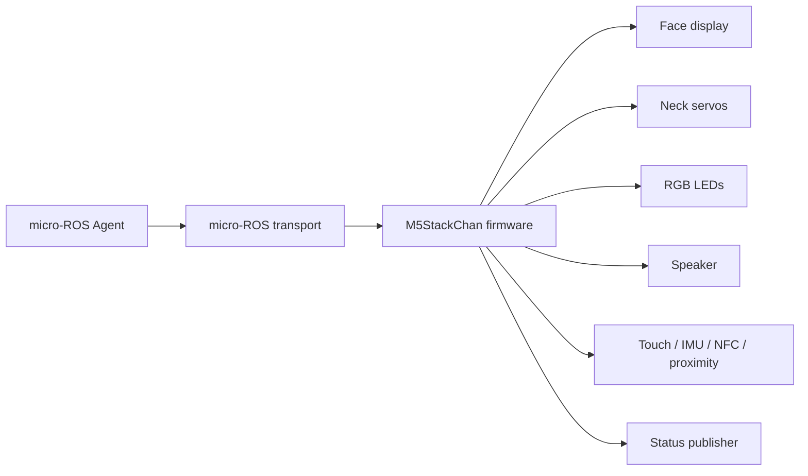
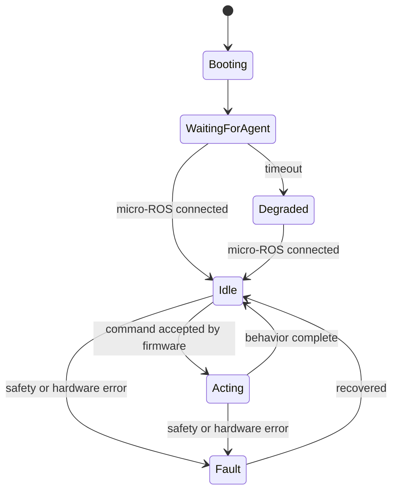

# Firmware Design

The firmware owns the device-side behavior of M5StackChan. It receives constrained commands through micro-ROS and turns them into local hardware actions.



## Goals

- Accept high-level commands from ROS 2.
- Drive face display, neck servos, LEDs, speaker, microphone, camera, NFC, IMU, and local sensors.
- Enforce physical safety limits on the device.
- Publish enough state for the PC-side bridge to know whether the robot is connected and healthy.
- Keep behavior deterministic when the PC sends simple commands such as `face happy` or `motion nod`.
- Keep each hardware feature independently developable behind a small adapter.

## Non-goals

- Do not run the main Codex logic on the device.
- Do not require cloud accounts or external authentication.
- Do not make the PC-side bridge responsible for the only copy of hardware safety limits.
- Do not expose raw hardware controls as the default public interface.
- Do not make the firmware depend on a specific Codex skill implementation.
- Do not fork the M5Stack factory firmware as the project baseline.

## Design stance

The firmware should be boring and protective. It should accept named robot intents, translate them into local behavior, and refuse anything unsafe or unsupported.

The PC side can be expressive; the device side should be constrained.

```text
Good:  motion = "nod", intensity = 0.5
Avoid: servo_x = 92, servo_y = 143, speed = 999
```

Raw controls may be useful for calibration later, but they should live behind explicit debug or maintenance interfaces, not the default command path.

## Hardware library policy

This project should not become a low-level hardware driver project. Hardware access should go through the official or community-maintained StackChan libraries whenever possible.

Preferred dependency direction:

- Use `StackChan-BSP` / `M5StackChan` style libraries for official M5StackChan hardware access.
- Use `M5Unified` and `M5GFX` through the supported StackChan library path rather than directly wiring every device feature from scratch.
- Treat servo drivers such as `FTServo_Arduino` as implementation details owned by the BSP layer unless a missing feature forces a small adapter.
- Keep `stackchan-arduino` in view as a community reference, especially for servo abstraction ideas, but do not mix multiple hardware abstraction stacks without a concrete reason.

This firmware owns the behavior layer:

- micro-ROS command ingress
- named command validation
- safety policy
- behavior-to-library adapter calls
- status publishing
- fault reporting and recovery

The lower layers own device mechanics:

- servo bus protocol
- display drawing primitives
- LED strip writes
- NFC, IMU, touch, proximity, audio, camera, and power-management drivers

If a hardware feature requires direct access, add it behind a small adapter and document why the BSP/library path was not enough.

Current references to re-check before implementation:

- M5Stack StackChan docs: official Arduino setup points users to the `M5StackChan` driver library and StackChan BSP resources.
- `m5stack/StackChan-BSP`: official board support package for Arduino development.
- `stack-chan/stackchan-arduino`: community Arduino library with servo abstraction for PWM, SCS, and Dynamixel XL330.
- M5Stack Home Assistant StackChan docs: useful for hardware ranges and component wiring, especially servo constraints.

Dependency and license policy is tracked in [license-notes.md](license-notes.md). In short: use `StackChan-BSP` as a dependency, treat `m5stack/StackChan` firmware as reference material, and avoid copying full upstream firmware trees into this repository.

## Baseline firmware decisions

- Build an independent custom firmware rather than forking the M5Stack factory firmware.
- Use `StackChan-BSP` as the preferred hardware access dependency.
- Keep factory firmware and community firmware as references, not as the implementation base.
- Structure hardware capabilities as separable adapters so face, motion, LED, audio, camera, NFC, IMU, and other sensors can be developed independently.
- Treat audio as a first-class capability, not a later decorative add-on.
- Keep cloud/account/app binding out of scope.
- Use USB Serial as the first micro-ROS transport.
- Use named intents as the default control model.
- Use `LOW`, `NORMAL`, `HIGH`, and `SAFETY` as the command priority model.
- Reserve `SAFETY` for bridge and firmware internal use.

The firmware should still start with a bring-up path, but the architecture should not assume that audio, camera, NFC, or raw IMU telemetry are out of scope. They are part of the target capability set.

## Configuration and calibration ownership

Configuration is split by risk:

- Firmware constants own hard safety limits.
- Firmware NVS owns individual device calibration, such as servo neutral offsets and safe per-device corrections.
- ROS package YAML owns normal operation tuning.
- CLI config owns convenience settings such as backend, default device, output mode, log level, and timeout defaults.

The firmware must not rely on CLI-side validation as the only protection for hardware safety.

Calibration NVS rules:

- Store a calibration schema version.
- Store servo neutral offsets and safe per-device corrections.
- Provide a reset-to-default calibration path.
- Export/import may be added through explicit maintenance tooling, not normal command paths.

Device identity is mapped in bridge configuration. Firmware may report hardware identity for diagnostics, but bridge configuration owns the `device_id` binding.

## Runtime responsibilities

At runtime, the firmware should maintain a small internal state machine.



Expected states:

- `booting`: hardware and display are being initialized.
- `waiting_for_agent`: firmware is alive but micro-ROS is not connected yet.
- `idle`: ready to accept commands.
- `acting`: running a face, motion, LED, or audio behavior.
- `degraded`: usable locally, but ROS connectivity is missing or partial.
- `fault`: a safety or hardware error needs to be reported.

## Command responsibilities

### Face

The firmware should map expression names to display behavior.

Baseline expressions:

- `neutral`
- `happy`
- `thinking`
- `surprised`
- `sleepy`
- `error`

The PC side can request an expression, but the firmware decides the exact rendering.

Face commands should be idempotent. Repeating `happy` should not create a queue of animations unless the command explicitly asks for an animation.

### Motion

The firmware should map motion names to servo trajectories.

Baseline motions:

- `nod`
- `shake`
- `look-left`
- `look-right`
- `look-user`
- `idle`

Safety constraints must be enforced here:

- Clamp servo angles to known-safe ranges.
- Reject or ignore commands that would exceed limits.
- Prefer named motion primitives over arbitrary angle commands.
- Provide a neutral or idle fallback.

Motion commands should be interruptible by higher-priority safety behavior. For example, if a fault is detected while a nod animation is running, the firmware should stop the animation and move toward a safe neutral pose.

Suggested internal motion model:

- Validate requested motion name.
- Resolve it to a bounded trajectory.
- Clamp each target to device limits.
- Execute with timing limits.
- Publish completion or error state.

Explicit head pose control is a separate safety path from named motion. It uses
home-frame absolute `pan_deg` and `tilt_deg` values, not StackChan-BSP `X/Y` as
a planar coordinate system. Firmware converts explicit pose degrees to BSP
units with `deg * 10` and calls `M5StackChan.Motion.move(...)`. `motion home`
is carried as a separate home mode and calls `goHome(...)`; it must not be
collapsed into an external `pose(0,0)` command before firmware planning.

Explicit pose safety rules:

- Keep explicit pose limits separate from named motion trajectory limits.
- Baseline external limits are `pan_deg=-128..128`, `tilt_deg=0..90`,
  `speed=0..1000`, and `duration_ms=0` or `100..2000`.
- External explicit pose values outside those limits are rejected with a
  structured error; they are not clamped.
- Named motion trajectories may clamp internally because they are firmware-owned
  safe trajectories.
- `motion home` is firmware-owned home/neutral behavior and requires valid
  calibration.
- Reject pose, home, and successful pose status when calibration is invalid,
  neutral offsets are missing, the home basis is corrupted, servo read fails, or
  firmware is in fault state.
- At most one pose action may be active per device. Repeated pose commands must
  be rate-limited or coalesced; the baseline helper rejects unavailable slots or
  commands inside the minimum interval with `FIRMWARE_BUSY`. Safety, neutral,
  and fault handling preempt all pose commands.
- Firmware safety helpers require callers to pass calibration validity, servo
  read state, fault state, active-slot availability, and elapsed time since the
  previous pose command. Unknown state should be treated as unsafe.

### LED

The firmware should map named LED patterns to local LED behavior.

Baseline patterns:

- `off`
- `progress`
- `success`
- `warning`
- `error`
- `listening`

LED behavior should be non-blocking. A long `progress` pattern should not prevent the firmware from accepting a `motion` or `face` command.

### Audio

Audio is a core capability. The firmware should support both output-oriented and input-oriented audio flows while keeping high-level dialog planning outside the device.

Baseline audio path:

- PC side generates TTS audio.
- Firmware plays audio through the device speaker.
- Firmware captures microphone audio.
- PC side owns STT, VAD, and dialog processing.
- Audio transport starts with PCM 16 kHz mono 16-bit.
- Playback and capture use actions coordinated with bounded audio chunks.
- Chunk duration is 20 ms by default; 40 ms is acceptable when transport overhead matters.

Output-oriented responsibilities:

- play short prompts or speech audio when provided by the PC side
- expose a `speaking` state while playback is active
- coordinate face, motion, and LED behavior during playback
- report playback completion or failure

Input-oriented responsibilities:

- expose microphone capture status
- stream or chunk microphone audio to the PC side when requested
- support simple wake/listening indicators
- report capture errors or overrun conditions

Non-responsibilities:

- do not own LLM dialog policy
- do not own cloud speech authentication
- do not require an external account to use local audio paths

The PC side may own speech-to-text, text-to-speech, voice activity detection, or LLM integration. The firmware should own reliable device I/O, state, and local feedback.

### Camera

Camera support should be treated as an independent capability.

Baseline responsibilities:

- initialize the camera through the supported library path
- provide QVGA JPEG snapshots to the PC side
- report capture status and errors
- avoid blocking motion and safety handling while camera capture is active

The firmware should not own high-level vision inference. Object detection, face detection, or visual reasoning should run on the PC side unless a very small local heuristic is explicitly needed.

Continuous camera streaming is out of the baseline contract. It requires a documented resource, transport, and QoS decision before implementation.

### NFC

NFC support should expose high-level events first.

Baseline responsibilities:

- report tag detected / removed events
- expose tag id or safe metadata when available
- avoid embedding application-specific meaning in firmware

The PC side or Codex skill should decide what a tag means.

Baseline events:

- `nfc_detected(tag_id)`
- `nfc_removed(tag_id)`

### Sensors

The firmware can expose local state through ROS 2:

- touch
- IMU
- proximity
- light
- NFC
- button or remote-control events
- camera capture status
- microphone capture/playback status

The baseline implementation should publish status needed by `stackchanctl observe`, while leaving room for raw telemetry channels.

Sensor data should be separated into two levels:

- high-level events, such as `touched`, `picked_up`, or `nfc_detected`
- raw telemetry, such as IMU samples, proximity values, or light values

High-level events are more useful to Codex skills. Raw telemetry is useful for debugging, calibration, and later robot behavior.

Raw IMU should be supported as a separate stream from high-level events. The initial raw IMU stream should start around 10-30 Hz, with higher rates treated as a later tuning decision. The firmware can publish lower-rate high-level posture/activity events for Codex while still making raw IMU telemetry available for ROS tooling, logging, and future behavior work.

Baseline high-level IMU events:

- `picked_up`
- `placed_down`
- `shaken`
- `tilted`
- `face_up`
- `face_down`

Official StackChan K151 observability also includes:

- Si12T three-zone touch state on `/stackchan/<device_id>/device/touch/state`
- LTR-553ALS-WA proximity telemetry on `/stackchan/<device_id>/device/proximity/raw`
- LTR-553ALS-WA ambient light telemetry on `/stackchan/<device_id>/device/light/raw`
- IR receiver/transmitter semantic events such as `remote_button_pressed`,
  `remote_command_received`, `ir_transmit_finished`, and `ir_transmit_failed`
- INA226 battery monitor and AXP2101 power-management telemetry on
  `/stackchan/<device_id>/device/power/status`

Firmware should publish the numeric telemetry at low rates and queue the
corresponding high-level events without blocking safety, motion-neutral, or
fault handling. Raw IR code/protocol dumps are debug-only and not part of the
normal ROS/Codex contract.

### Device-side event publishing

Firmware publishes hardware-origin high-level events to
`/stackchan/<device_id>/device/events`. The bridge owns the public
`/stackchan/<device_id>/events` topic, where it normalizes, redacts, debounces,
buffers, and republishes events for `stackchanctl`, MCP, and diagnostics.

Firmware event publishers should:

- bound event names and payloads before publishing
- include `device_id`
- include `command_id` only when an event is associated with a command
- leave application meaning to the PC/Codex side
- avoid putting speech transcripts, image payloads, PCM audio, or large data in
  `payload_json`

Baseline firmware event sources:

- button: `button_pressed`, `button_released`, `button_held`
- IMU/posture: `picked_up`, `placed_down`, `shaken`, `tilted`, `face_up`, `face_down`
- NFC: `nfc_detected`, `nfc_removed`
- NFC failures: `nfc_read_failed`
- audio device errors: `mic_overrun`, `audio_playback_underrun`,
  `audio_capture_started`, `audio_capture_finished`, `audio_capture_failed`
- device health: `camera_capture_failed`, `battery_low`, `transport_unstable`
- touch/proximity/light: `touched`, `touch_released`, `touch_held`,
  `proximity_near`, `proximity_clear`, `light_changed`, `dark_detected`,
  `bright_detected`
- remote/IR: `remote_button_pressed`, `remote_button_released`,
  `remote_button_held`, `remote_command_received`, `ir_transmit_started`,
  `ir_transmit_finished`, `ir_transmit_failed`
- power: `battery_recovered`, `charging_started`, `charging_stopped`,
  `power_source_changed`, `brownout_risk`, `power_fault`

`button_held` uses a firmware-owned 700 ms default threshold. Bridge may
coalesce repeated events, but hardware bounce belongs on the device side.

Device event publication is non-blocking from estimator callbacks. Firmware
queues bounded `DeviceEvent` records first and drains them later through the
micro-ROS publisher below safety and motion-neutral work. If the event queue is
full or the publisher is unavailable, firmware returns a recoverable structured
error instead of blocking sensor or fault handling.

## State publishing

The firmware should publish health and state information such as:

- connection heartbeat
- current face
- current motion or idle state
- last accepted command id
- last error code

The exact ROS 2 interface belongs in [ros-interface.md](ros-interface.md).

## Safety policy

The firmware is the last line of defense before physical hardware. Even if the PC-side bridge or CLI sends a bad command, firmware should keep the device within known-safe behavior.

Minimum safety rules:

- Clamp servo angles and motion speed.
- Reject unknown motion names.
- Bound animation duration.
- Keep a neutral pose fallback.
- Stop current motion when a fault is detected.
- Rate-limit repeated commands if they would create unstable behavior.
- Publish the last rejected command reason.

Safety decisions should prefer "do nothing and report why" over trying to guess what the caller meant.

## Command priority and resource arbitration

The firmware should support a simple priority model.

Priority values:

- `LOW`
- `NORMAL`
- `HIGH`
- `SAFETY`

`SAFETY` is reserved for firmware and bridge internal use. CLI and Codex-originated commands should not be allowed to request `SAFETY` priority directly.

Execution semantics:

- `LOW` never preempts active behavior.
- `NORMAL` is FIFO within the same resource class.
- `HIGH` may preempt lower-priority face, LED, or motion behavior.
- `SAFETY` preempts everything when generated internally by firmware or bridge safety handling.
- CLI-originated `SAFETY` must be rejected, not downgraded.

Resource arbitration order:

1. Safety and fault handling.
2. Motion stop / neutral pose.
3. Audio capture and playback.
4. Command handling.
5. Camera capture.
6. LED and idle animation.

This avoids a long-running decorative behavior blocking a more important command.

## Failure behavior

Failures should be visible, boring, and recoverable.

Default behavior:

- If micro-ROS disconnects, enter `degraded`, keep local safety behavior active, and keep trying to reconnect.
- If audio playback underruns, stop playback, publish an audio error, and return to a neutral speaking state.
- If microphone capture overruns, drop the current chunk, publish an overrun error, and keep capture recoverable.
- If camera capture fails, publish the error and keep motion/audio/safety handling alive.
- If NFC read fails, publish an event error without assigning meaning to the tag.
- If servo or motion safety fails, stop current motion, move toward neutral if safe, enter `fault`, and publish the rejection reason.

The firmware should prefer stopping a behavior and publishing a clear reason over trying to infer a risky fallback.

## Dependency pinning

Baseline firmware development uses PlatformIO with the Arduino framework.

Recommended baseline:

```ini
[env:stackchan-cores3]
platform = platformio/espressif32@6.7.0
board = m5stack-cores3
framework = arduino

board_microros_transport = serial
board_microros_distro = jazzy

lib_deps =
    https://github.com/m5stack/StackChan-BSP.git#1.1.0
    https://github.com/micro-ROS/micro_ros_platformio.git#<verified-main-commit-sha>
```

Pinning rules:

- Pin `StackChan-BSP` to the Git tag `1.1.0` initially.
- Use `micro_ros_platformio` for PlatformIO integration, pinned to a verified `main` commit SHA rather than a moving branch.
- Use ROS 2 Jazzy as the initial micro-ROS distro because it is the current LTS direction.
- Let `StackChan-BSP` resolve `M5Unified`, `M5GFX`, `IRremoteESP8266`, and `M5Unit-NFC` at first.
- Promote transitive dependencies to explicit pins only if reproducibility breaks.
- Treat the `FTServo_Arduino` driver as owned by the `StackChan-BSP` layer unless a concrete adapter need appears.

Known uncertainty:

- `StackChan-BSP` may lag between Arduino Library Manager and GitHub releases, so prefer the Git tag URL.
- `micro_ros_platformio` release tags may lag current ROS 2 distro support, so commit SHA pinning is safer than tag pinning for Jazzy.
- `m5stack-cores3` should be the first PlatformIO board target. If bring-up fails, `esp32-s3-devkitc-1` plus CoreS3-specific flags is the fallback to investigate.

## Bring-up plan

The first firmware slice should prove the device loop and safety boundary, but it should not define the full scope of supported capabilities.

1. Boot and show a neutral face.
2. Connect to micro-ROS.
3. Publish heartbeat/status.
4. Handle one face service command.
5. Handle one motion action command, such as `nod`.
6. Enforce servo limits in firmware.
7. Publish `ACCEPTED` or `REJECTED` command state through the shared result model.
8. Add LED command support.
9. Add audio playback/capture status.
10. Add raw IMU stream.
11. Add NFC event stream.
12. Add constrained camera snapshot support.

Face, motion, LED, audio, camera, NFC, and IMU work should be designed as independent adapters so they can advance in parallel without turning the firmware into a fork of the factory application.

## Open design questions

- Which verified `micro_ros_platformio` commit SHA should become the first pinned baseline after bring-up?
